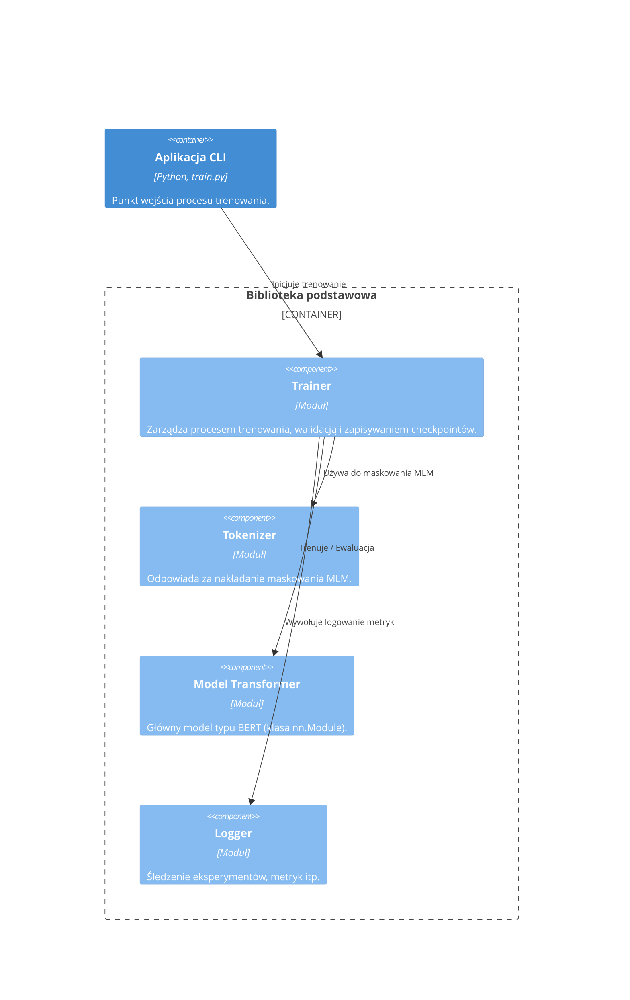
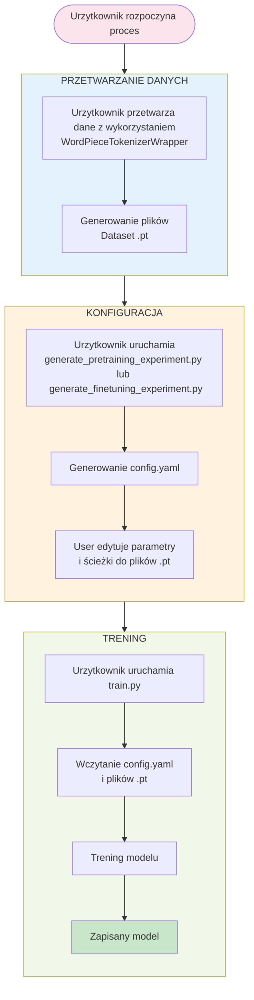
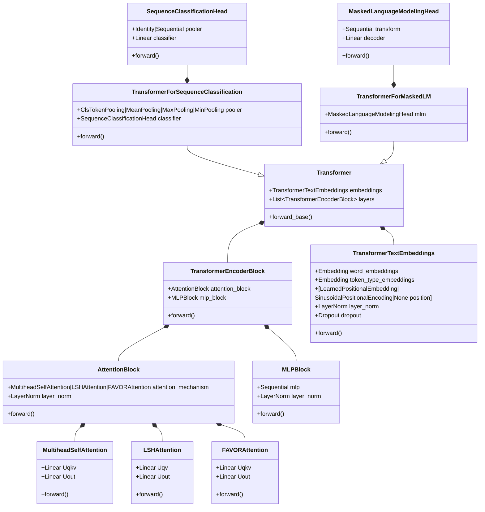

# Diagrms

## Component Diagram

```mermaid
C4Component
    Container(cli, "Aplikacja CLI", "Python, train.py", "Punkt wejścia procesu trenowania.")

    Container_Boundary(lib, "Biblioteka podstawowa") {
        Component(trainer, "Trainer", "Moduł", "Zarządza procesem trenowania, walidacją i zapisywaniem checkpointów.")
        Component(tokenizer, "Tokenizer", "Moduł", "Odpowiada za nakładanie maskowania MLM.")
        Component(model, "Model Transformer", "Moduł", "Główny model typu BERT (klasa nn.Module).")
        Component(logger, "Logger", "Moduł", "Śledzenie eksperymentów, metryk itp.")
    }

    Rel(cli, trainer, "Inicjuje trenowanie")
    Rel(trainer, model, "Trenuje / Ewaluacja")
    Rel(trainer, tokenizer, "Używa do maskowania MLM")
    Rel(trainer, logger, "Wywołuje logowanie metryk")
```

## End-to-End Workflow Diagram

```mermaid
flowchart TB
    Start([Urzytkownik rozpoczyna proces]) --> Phase1

    subgraph Phase1[" PRZETWARZANIE DANYCH "]
        direction TB
        A1[Urzytkownik przetwarza dane z wykorzystaniem<br/>WordPieceTokenizerWrapper]
        A2[Generowanie plików<br/>Dataset .pt]

        A1 --> A2
    end

    subgraph Phase2[" KONFIGURACJA "]
        direction TB
        B1[Urzytkownik uruchamia<br/>generate_pretraining_experiment.py lub <br/> generate_finetuning_experiment.py]
        B2[Generowanie config.yaml]
        B3[User edytuje parametry<br/>i ścieżki do plików .pt]

        B1 --> B2 --> B3
    end

    subgraph Phase3[" TRENING "]
        direction TB
        C1[Urzytkownik uruchamia train.py]
        C2[Wczytanie config.yaml<br/>i plików .pt]
        C3[Trening modelu]
        C4[Zapisany model]

        C1 --> C2 --> C3 --> C4
    end

    Phase1 --> Phase2
    Phase2 --> Phase3

    style Phase1 fill:#e3f2fd
    style Phase2 fill:#fff3e0
    style Phase3 fill:#f1f8e9
    style Start fill:#fce4ec
    style C4 fill:#c8e6c9
```

## Detailed Models Class Diagram

```mermaid
classDiagram
direction TB


    class TransformerForSequenceClassification {
	    +ClsTokenPooling|MeanPooling|MaxPooling|MinPooling pooler
	    +SequenceClassificationHead classifier
	    +forward()
    }

    class TransformerForMaskedLM {
	    +MaskedLanguageModelingHead mlm
	    +forward()
    }

    class Transformer {
	    +TransformerTextEmbeddings embeddings
	    +List~TransformerEncoderBlock~ layers
	    +forward_base()
    }

    class TransformerEncoderBlock {
	    +AttentionBlock attention_block
	    +MLPBlock mlp_block
	    +forward()
    }

    class TransformerTextEmbeddings {
	    +Embedding word_embeddings
	    +Embedding token_type_embeddings
        +[LearnedPositionalEmbedding|
        SinusoidalPositionalEncoding|None position]
	    +LayerNorm layer_norm
	    +Dropout dropout
	    +forward()
    }

    class AttentionBlock {
	    +MultiheadSelfAttention|LSHAttention|FAVORAttention attention_mechanism
	    +LayerNorm layer_norm
	    +forward()
    }

    class MLPBlock {
	    +Sequential mlp
	    +LayerNorm layer_norm
	    +forward()
    }

    class MultiheadSelfAttention {
	    +Linear Uqkv
	    +Linear Uout
	    +forward()
    }

    class LSHAttention {
	    +Linear Uqv
	    +Linear Uout
	    +forward()
    }

    class FAVORAttention {
	    +Linear Uqkv
	    +Linear Uout
	    +forward()
    }

    class SequenceClassificationHead {
	    +Identity|Sequential pooler
	    +Linear classifier
	    +forward()
    }

    class MaskedLanguageModelingHead {
	    +Sequential transform
	    +Linear decoder
	    +forward()
    }

    TransformerForSequenceClassification --|> Transformer
    SequenceClassificationHead --* TransformerForSequenceClassification
    TransformerForMaskedLM --|> Transformer
    MaskedLanguageModelingHead --* TransformerForMaskedLM
    Transformer *-- TransformerTextEmbeddings
    Transformer *-- TransformerEncoderBlock
    TransformerEncoderBlock *-- AttentionBlock
    TransformerEncoderBlock *-- MLPBlock
    AttentionBlock *-- MultiheadSelfAttention
    AttentionBlock *-- LSHAttention
    AttentionBlock *-- FAVORAttention
```
